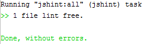

## Bower dependencies

In this exercise, you are dealing with package conflicts. After you solve them correctly, you should run the application as in **Reslut**.

###Requirements
* resolved conflicts should be added to the **bower.json** file

###Result
* when conflicts in dependencies are resolved correctly

###Before you start, read about
[bower-how-to](http://herereadthis.com/code/bower-how-to)

Good luck!
