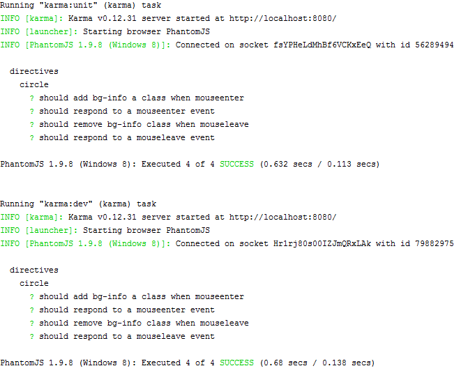
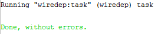
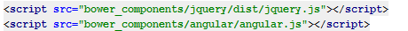

## Grunt configuration exercise

Configure **Gruntfile.js** in accordance with the requirements. You start with ready **grunt serve** command

###Requirements
* add a property corresponding to a jshint: 
    * use the options provided in **.jshintrc** file
    * check all **.js** files in **app** folder
* add a property corresponding to a karma test
    * check **scripts** in **bower.json** file
    * **unit** should start once / **dev** should be available at all times
    * you find **karma** configuration in **test** folder
* add a property corresponding to a  wiredep
    * modify **index.html** file that **wiredep command** inject **css* and *js** dependency in the right places
    * test it using  ```bower install bootstrap --save``` 
    * modify 'wiredep' so as not to inject the **bootstrap.js** file  
* install the necessary plugins

    
###Results
* **grunt jshint** command result


* **grunt karma** command result



* **grunt wiredep** command result



* **.js** file added



* **.css** file add


###Before you start, please refer to:
* [grunt-contrib-jshint](https://github.com/gruntjs/grunt-contrib-jshint)
* [grunt-karma](https://github.com/karma-runner/grunt-karma)
* [grunt-wiredep](https://github.com/stephenplusplus/grunt-wiredep)

Good luck!
