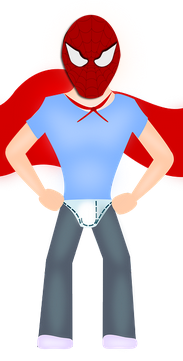

##Exercise 8 : Angular first directive

The world need more heroes. You are given a hard task to create at least two heroes and one superhero. Implement three simple directives that will
allow you to create as many heroes as you need.

###Requirements
* hero directive restricted as element and with given template as follows: *``````*
* mask directive restricted as element and with given template as follows: *``````*
* superhero directive restricted as element with template that use previous directives (you should put mask after the hero element)
* directives used in correct places at **index.html** (check comments)

###Result
The superhero should look as follows:



###Before you start, please refer to:
* [angularjs-first-directive](https://egghead.io/lessons/angularjs-first-directive)
* [write-your-first-directive](https://egghead.io/lessons/write-your-first-directive)


Good luck!
